```
G5 Test Assignment
Vladislav Yelfimov
```


# Общие принципы

## 1. Использование единого шаблона договора

Все договоры оформляются на основе единого шаблона, согласованного с юридическим отделом. Все правки вносятся в этот шаблон.

## 2. Учет версий

Все участники при внесении изменений используют систему версионности, чтобы исключить противоречия и случайные потери данных.

## 3. Соблюдение сроков

Каждый участник обязан выполнять свою часть работы в согласованные сроки, чтобы процесс не затягивался.

## 4. Прозрачность и распределение ролей

- **Ассистент** координирует взаимодействие и общение со всеми сторонами.
- **Старший юрист** и **Руководитель юридического отдела** отвечают за юридическую корректность текста.
- **Руководитель или менеджер отдела маркетинга** инициирует процесс и контролирует соответствие коммерческим требованиям.
- **Генеральный директор** осуществляет окончательное подписание.

## 5. Формат взаимодействия

Основной канал общения — электронная почта, чтобы сохранялась история согласования.

# Стадия 1

## Участники:

- **Руководитель или менеджер отдела маркетинга** (инициирует процесс)
- **Ассистент** (координирует и общается с подрядчиком)
- **Старший юрист** (проверяет и редактирует текст)
- **Руководитель юридического отдела** (дает финальное разрешение)

## Начало:

Возникает потребность в новом договоре, о чём руководитель или менеджер отдела маркетинга уведомляет Ассистента.

## Основные шаги:

1. Руководитель или менеджер отдела маркетинга формирует запрос на договор и передаёт информацию Ассистенту.
2. Ассистент отправляет подрядчику типовой шаблон или получает предложенный вариант, согласованный с юридическим отделом.
3. Подрядчик вносит свои комментарии и возвращает документ.
4. Ассистент передаёт договор Старшему юристу.
5. Старший юрист проверяет текст и при необходимости корректирует.
6. Руководитель юридического отдела даёт окончательное разрешение на подписание.

## Окончание:

Договор в утверждённом виде готов к подписанию.

## Результат:

Подготовленный к подписанию текст, согласованный юридическим отделом.

# Стадия 2

## Участники:

- **Генеральный директор** (подписывает договор)
- **Ассистент** (организует подписание, общается с подрядчиком)
- **Руководитель или менеджер отдела маркетинга** (контролирует запуск проекта)

## Начало:

Договор одобрен юридическим отделом и готов к подписанию.

## Основные шаги:

1. Ассистент отправляет согласованный текст подрядчику для подписания.
2. Подрядчик подписывает и передаёт оригинал договора обратно.
3. Ассистент передаёт договор на подпись Генеральному директору.
4. Генеральный директор подписывает документ.
5. Ассистент формирует полный пакет документов, регистрирует в архиве или внутренней системе.
6. Ассистент уведомляет всех участников о факте подписания.

## Окончание:

Подписанный оригинал договора передаётся на хранение, а второй экземпляр остаётся у подрядчика.

## Результат:

Окончательно подписанный договор, заархивированный и готовый к исполнению.

## Схема бизнес-процесса (Event-driven process chain)

```mermaid
flowchart TB
    A((Возникла потребность в договоре)) --> B[Маркетинг формирует запрос]
    B --> C((Запрос на договор сформирован))
    C --> D[Ассистент связывается с подрядчиком,\nпередаёт шаблон]
    D --> E((Договор с правками получен))
    E --> F[Старший юрист проверяет текст,\nвносит корректировки]
    F --> G((Проверка завершена))
    G --> H[Руководитель юридического отдела\nдаёт разрешение]
    H --> I((Договор одобрен))
    I --> J[Ассистент отправляет договор\nподрядчику на подпись]
    J --> K((Подрядчик вернул подписанный экземпляр))
    K --> L[Ассистент передаёт документ\nГенеральному директору]
    L --> M((Документ у Генерального директора))
    M --> N[Генеральный директор\nподписывает документ]
    N --> O((Договор подписан обеими сторонами))
    O --> P[Ассистент регистрирует,\nуведомляет участников]
    P --> Q((Процесс завершён,\nдоговор в архиве))
```

