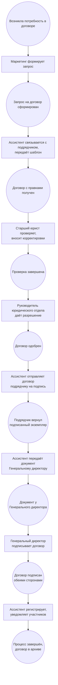



```mermaid
flowchart TB
    A((Возникла потребность в договоре)) --> B[Маркетинг формирует запрос]
    B --> C((Запрос на договор сформирован))
    C --> D[Ассистент связывается с подрядчиком,\nпередаёт шаблон]
    D --> E((Договор с правками получен))
    E --> F[Старший юрист проверяет,\nвносит корректировки]
    F --> G((Проверка завершена))
    G --> H[Руководитель юридического отдела\nдаёт разрешение]
    H --> I((Договор одобрен))
    I --> J[Ассистент отправляет договор\nподрядчику на подпись]
    J --> K((Подрядчик вернул\nподписанный экземпляр))
    K --> L[Ассистент передаёт документ\nГенеральному директору]
    L --> M((Документ у\nГенерального директора))
    M --> N[Генеральный директор\nподписывает договор]
    N --> O((Договор подписан\nобеими сторонами))
    O --> P[Ассистент регистрирует,\nуведомляет участников]
    P --> Q((Процесс завершён,\nдоговор в архиве))
```

